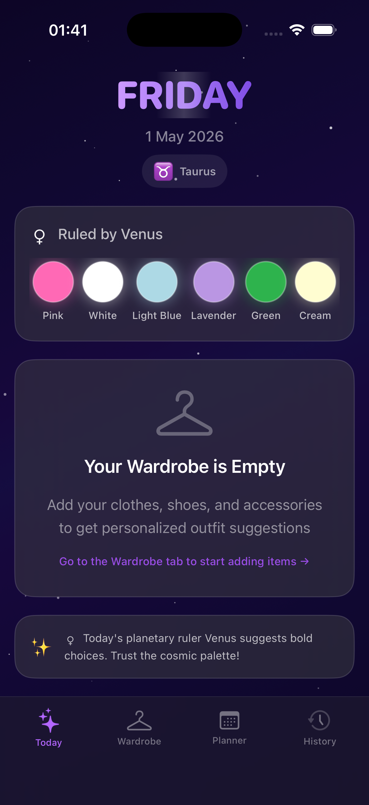
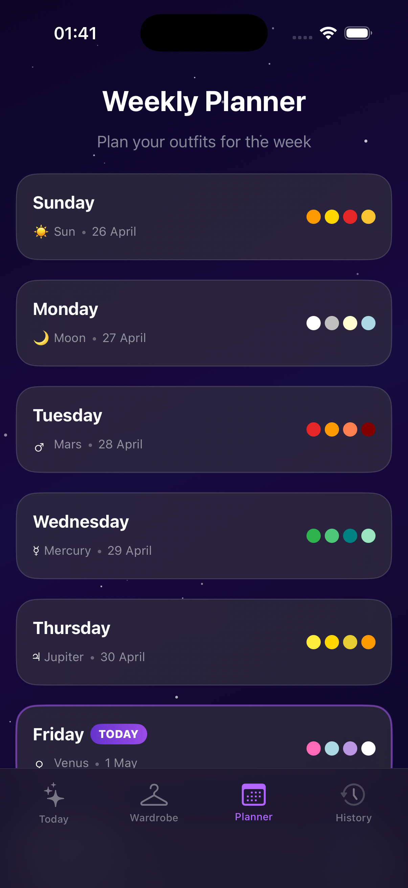
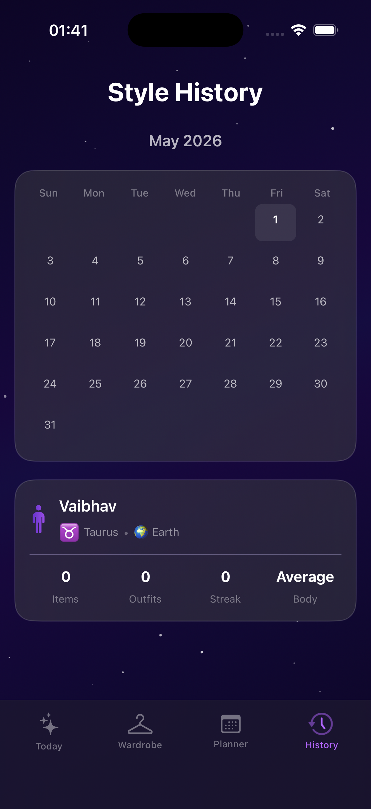

# StyleMate 🎨✨ — Daily Outfit & Lucky Color Advisor

A native iOS SwiftUI app that solves the classic **"what should I wear today?"** problem by combining your personal wardrobe with **Vedic astrological color recommendations**.

Every morning, the app shows you today's day, your astrologically lucky colors, and suggests a complete outfit from your own wardrobe — visualized on a body silhouette.

## Screenshots

  
  
  

## Features

- 🌟 **Onboarding Wizard** — Name, DOB (auto zodiac detection), gender, skin tone, body type
- 👔 **Today's Outfit** — Lucky colors + AI-matched outfit from your wardrobe
- 🧍 **Body Silhouette Preview** — See outfit colors on a stylized human figure
- 👕 **Wardrobe Manager** — Catalog clothes, shoes & accessories with photos and colors
- 🔀 **Shuffle Suggestions** — Get alternate outfit ideas with one tap
- 📅 **Weekly Planner** — Plan outfits for the entire week ahead
- 📆 **Outfit History** — Calendar view of what you wore + streak tracking
- ♈ **Vedic Astrology Engine** — Day-Planet-Color mapping × Zodiac sign compatibility

## Astrology Color System

| Day | Planet | Lucky Colors |
|-----|--------|-------------|
| Monday | Moon 🌙 | White, Silver, Cream, Light Blue |
| Tuesday | Mars ♂️ | Red, Orange, Coral, Maroon |
| Wednesday | Mercury ☿️ | Green, Emerald, Teal, Mint |
| Thursday | Jupiter ♃ | Yellow, Gold, Mustard, Amber |
| Friday | Venus ♀️ | Pink, Light Blue, Lavender, White |
| Saturday | Saturn ♄ | Black, Navy, Blue, Grey |
| Sunday | Sun ☀️ | Orange, Gold, Red, Saffron |

## Tech Stack

- **SwiftUI** — 100% native iOS UI
- **Swift 5.0** — iOS 16.0+
- **Zero Dependencies** — No third-party packages
- **Local Storage** — UserDefaults + JSON files + photo storage
- **PhotosUI** — Native iOS photo picker integration

## Design

- 🌌 Dark cosmic theme with star particle background
- 🪟 Glassmorphism cards
- ✨ Shimmer effects & smooth animations
- 💜 Cosmic purple gradient accent

## How to Run

1. Clone this repository
2. Open `StyleMate.xcodeproj` in Xcode 15+
3. Select any iOS Simulator (iPhone 17 Pro recommended)
4. Press **⌘R** to build and run

## License

MIT
